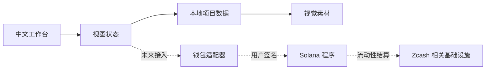

# 系统架构

## 设计目标

ZCode 当前是一个前端优先的启动台原型。界面层、内容层和未来的链上适配层保持清晰边界，让项目可以从静态演示逐步演进为可审计的软件产品。

## 分层结构



| 层级 | 当前实现 | 后续职责 |
| --- | --- | --- |
| 展示层 | React、CSS、Lucide | 访问性、动效、响应式体验 |
| 页面层 | `src/App.tsx` | 导航、演示状态、交互反馈 |
| 内容层 | `src/data/projects.ts` | 项目卡片、活动、可验证的展示数据 |
| 素材层 | `public/media/` | 项目封面、社交分享图、品牌图形 |
| 链上层 | 暂未启用 | 钱包连接、交易确认、索引和错误恢复 |
| 安全层 | 文档与免责声明 | 审计、权限边界、合规与应急响应 |

## 状态边界

- 演示钱包状态只存在于浏览器内存，刷新页面后会重置。
- 演示按钮不会发送交易，也不会读取私钥。
- 项目募集数字是展示数据，不代表链上余额、承诺收益或实际募集结果。
- 未来接入时，所有签名必须由用户钱包完成，服务端不得接触私钥。

## 目录说明

```text
src/
  data/              可替换的项目与活动数据
  App.tsx            页面组合与演示交互
  main.tsx           React 挂载入口
  styles.css         全局设计系统
  project-artwork.css 项目视觉组件样式
public/
  media/             项目卡片图片
  og-cover.svg       GitHub 与社交分享封面
docs/                产品、工程和运营文档
.github/              自动检查与 Issue 模板
```
